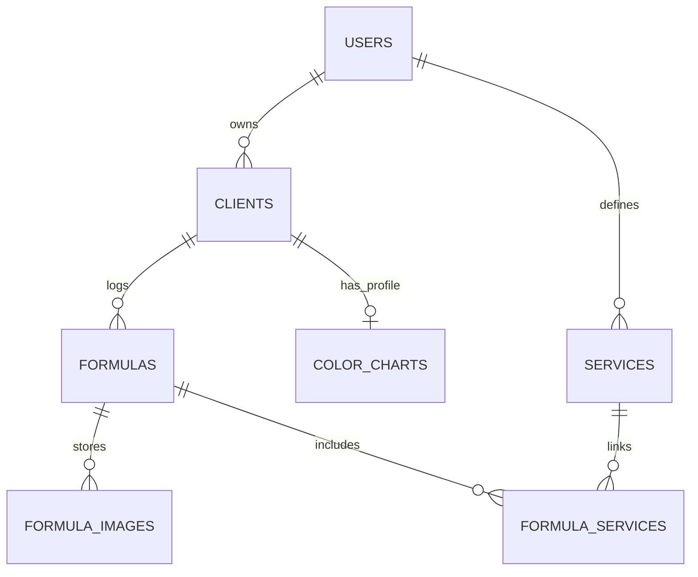

# MyGuest v2 Simplified ERD

This version is intentionally product-facing. It keeps the real database table
names attached to each entity, but focuses on the business objects and the
relationships that matter most when you are trying to understand the app.

## Core Model

### Notation

- `||` = exactly one
- `o|` = zero or one
- `o{` = zero or many

## Entity Guide

### Account (`users`)

- One record per authenticated MyGuest user
- Owns all clients
- Owns all service presets
- Key fields:
  - `firebase_uid`
  - `email`
  - `first_name`
  - `last_name`
  - `photo_url`

### Client (`clients`)

- One record per salon client
- Belongs to exactly one account
- Can have one color profile
- Can have many appointment logs
- Key fields:
  - `owner_user_id`
  - `first_name`
  - `last_name`
  - `email`
  - `phone`
  - `birthday`
  - `client_type`
  - `notes`

### Color Profile (`color_charts`)

- Optional one-to-one extension of a client
- Stores consultation and color-reference details
- Key fields:
  - `client_id`
  - `porosity`
  - `hair_texture`
  - `elasticity`
  - `natural_level`
  - `desired_level`
  - `contrib_pigment`
  - `gray_front`
  - `gray_sides`
  - `gray_back`

### Appointment Log (`formulas`)

- One row per appointment / formula history entry
- Belongs to a client
- Can have many attached photos
- Can link to many service presets through `formula_services`
- Key fields:
  - `client_id`
  - `service_at`
  - `price_cents`
  - `notes`
  - `service_type`

### Appointment Photo (`formula_images`)

- One row per stored formula photo
- Belongs to an appointment log
- Supports provider + URL/object-key storage metadata
- Key fields:
  - `formula_id`
  - `storage_provider`
  - `public_url`
  - `object_key`
  - `file_name`

### Service Preset (`services`)

- User-owned service catalog
- Reusable presets such as Cut, Color, or Cut and Color
- Can be reused across many appointment logs
- Key fields:
  - `owner_user_id`
  - `name`
  - `normalized_name`
  - `sort_order`
  - `default_price_cents`
  - `default_return_weeks`
  - `is_active`

### Appointment Service Link (`formula_services`)

- Ordered join table between appointment logs and service presets
- Stores the snapshot label used at the time of the appointment
- Key fields:
  - `formula_id`
  - `service_id`
  - `service_label_snapshot`
  - `position`

## Relationship Summary

- One account owns zero or many clients.
- One account defines zero or many service presets.
- One client can have zero or one color profile.
- One client can have zero or many appointment logs.
- One appointment log can have zero or many photos.
- One appointment log can have zero or many service links.
- One service preset can appear in zero or many appointment service links.

## Important Implementation Notes

- `formula_services` is the normalized multi-service model.
- `formulas.service_type` still exists as a legacy-friendly field and may still
  appear in older records and API payloads.
- `color_charts.client_id` is unique, which is what makes the client-to-color
  relationship truly one-to-one.
- `services` is unique by `(owner_user_id, normalized_name)`, so a single user
  cannot create duplicate presets that normalize to the same label.
